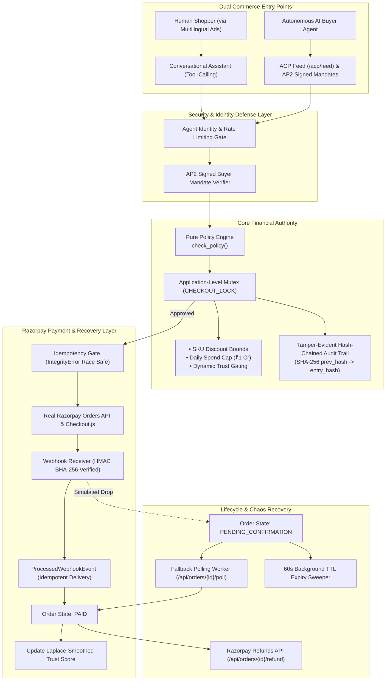

# ⚡ Razorpay Autonomous Agent Merchant System (Hardened)

An enterprise-grade, production-hardened autonomous agent merchant platform built on **Razorpay TEST-MODE APIs**.

The system enables two primary commerce entry points:
1. **Human Conversational Commerce**: AI-generated multilingual ads driving human buyers to an LLM tool-calling conversational checkout with official Razorpay Checkout.js.
2. **Autonomous Agent-to-Agent Commerce**: AI buyer agents transacting end-to-end via Agentic Commerce Protocol (ACP) feeds, AP2-style signed mandates, discount negotiations, and programmatic checkouts.

Both entry points share **ONE pure policy engine**, **ONE cryptographically hash-chained audit trail**, and **ONE Razorpay integration**.

---

## 🏛️ Hardened System Architecture



---

## 🏆 Key Hardened Invariants & Capabilities

| Area | Implementation & Security Standard | Status |
| :--- | :--- | :---: |
| **Financial Authority** | `check_policy()` in `policy_engine.py` is the single source of truth. No LLM or frontend computes discounts or prices. | ✅ Verified |
| **Real Razorpay Checkout** | Real `https://checkout.razorpay.com/v1/checkout.js` widget loaded on frontend. Fabricated payment links completely removed. | ✅ Verified |
| **Cryptographic HMAC Verification** | Payment verification on `/api/orders/{ref}/verify-payment` requires `razorpay_signature` and enforces HMAC SHA-256. Forged signatures rejected with `400`. | ✅ Verified |
| **Webhook Idempotency** | Webhooks verified via HMAC SHA-256 and tracked in `ProcessedWebhookEvent`. Replayed events return 200 without duplicate state mutations. | ✅ Verified |
| **Concurrency & TOCTOU Protection** | Database insert race conditions handled via `IntegrityError` rollback & replay. Daily spend checks wrapped in synchronization mutex. | ✅ Verified |
| **Admin Authentication** | All `/api/admin/*` routes (approvals and rejections) secured with HTTP Basic Authentication (`get_current_admin`). | ✅ Verified |
| **Agent Identity & Rate Limiting** | Agent API keys verified via `X-Agent-Key` hash matching. Sliding window rate limiter (30 req/min). | ✅ Verified |
| **Money Lifecycle Completeness** | Admin rejection endpoint, Razorpay Refunds API integration (`/api/orders/{ref}/refund`), and 60s background TTL order expiry sweeper. | ✅ Verified |
| **Protocol Alignment (ACP & AP2)** | Standards-aligned product feed (`GET /acp/feed`), ACP checkout sessions lifecycle, and AP2-style cryptographically signed buyer mandates. | ✅ Verified |
| **Tamper-Evident Audit Trail** | Every audit entry computed via SHA-256 hash chaining (`entry_hash = sha256(prev_hash + data)`). Verified via `GET /api/audit/verify`. | ✅ Verified |

---

## 🚀 Quickstart & Verification

### 1. Prerequisites & Setup
```bash
cd /home/saksham/.gemini/antigravity/scratch/razorpay-agent-merchant

# Create and activate Python virtual environment
python3 -m venv .venv
source .venv/bin/activate
pip install -r requirements.txt
```

### 2. Run Automated Pytest Suite (`16/16 Passed`)
```bash
./run.sh test
# or: .venv/bin/pytest tests/ -v
```
Verifies unit policy rules, concurrency idempotency races, HMAC signature enforcement, dead links, refunds, admin auth, ACP feed, and AP2 mandates.

### 3. Run Multilingual Conversation Evaluation Harness (`20/20 Passed`)
```bash
.venv/bin/python3 -m tests.eval_conversations
```
Evaluates 20 synthetic customer conversations across English, Hindi, Tamil, Telugu, and Spanish.

### 4. Run Autonomous AI Buyer Agent
```bash
.venv/bin/python3 scripts/buyer_agent.py
```
Executes an autonomous goal-directed multi-turn purchasing agent transacting directly against the merchant API.

### 5. Launch the Server & UI Dashboard
```bash
./run.sh
# or: .venv/bin/uvicorn backend.app.main:app --host 0.0.0.0 --port 8000
```
Open **[http://localhost:8000](http://localhost:8000)** in your browser.

---

## 📡 API Reference

### Core Commerce Endpoints
- `GET /api/catalog` — Merchant product catalog with discount caps and approval thresholds.
- `POST /api/negotiate` — Policy engine discount evaluation with AP2 buyer mandate checks.
- `POST /api/checkout` — Idempotent order checkout generating Razorpay test orders.
- `POST /api/orders/{ref}/verify-payment` — Cryptographic HMAC SHA-256 payment signature verification.
- `POST /api/orders/{ref}/refund` — Full refund execution via Razorpay Refunds API.
- `POST /api/orders/{ref}/poll` — Fallback recovery polling against Razorpay Payments API.
- `POST /api/webhooks/razorpay` — HMAC SHA-256 verified idempotent webhook handler.

### Protocol Alignment Endpoints
- `GET /acp/feed` — Agentic Commerce Protocol (ACP) standardized product feed.
- `POST /acp/checkout_sessions` — ACP checkout session creation.
- `POST /acp/checkout_sessions/{id}/complete` — ACP checkout finalization.

### Security & Audit Endpoints
- `GET /api/audit` — Queryable explainable audit trail with trust score leaderboard.
- `GET /api/audit/verify` — Cryptographic hash chain validation walking SHA-256 integrity links.
- `POST /api/admin/orders/{ref}/approve` — Authenticated merchant approval (HTTP Basic Auth).
- `POST /api/admin/orders/{ref}/reject` — Authenticated merchant rejection (HTTP Basic Auth).
